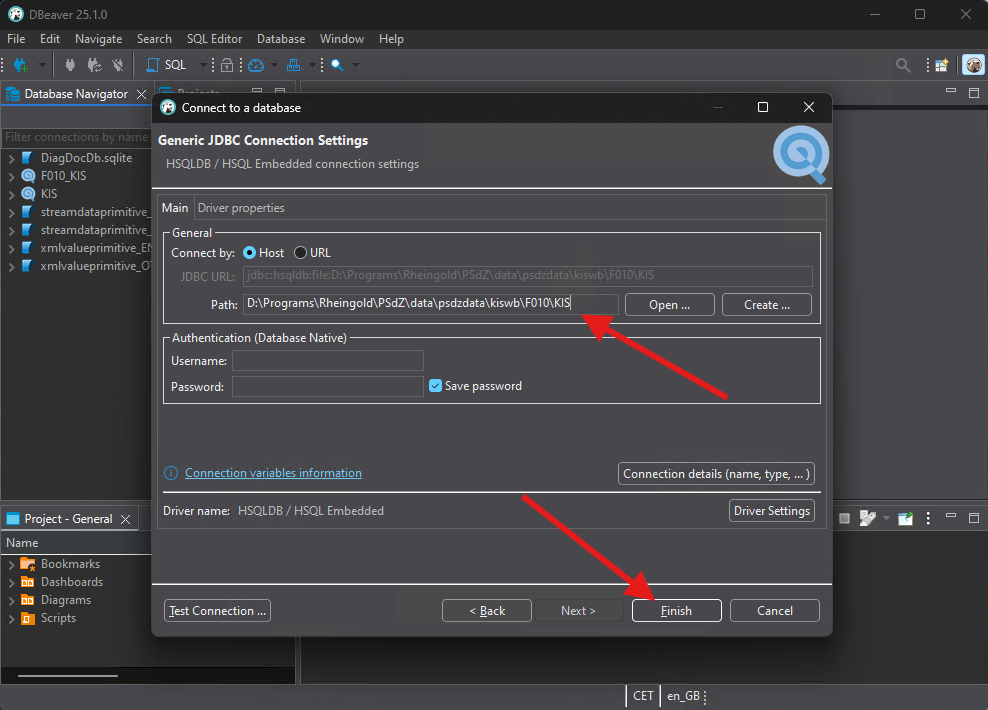

# Service Data

Service data, usually referred to as _PSdzData_, contains information about each vehicle family and the hardware and software that it may be running for each configuration.

The _PSdzData_ can be divided into two parts. The first part, _PSdZ_, stands for _Programmiersystem der Zukunft_ or programming system of the future in English.

## KISWB

_PSdzData_ has many many components. Inside _PSdzData_ folder structures you may find some folders named KISWB. The _WB_ portion of that name comes from WissensBasis that means knowledge base in English.

The files contained inside KISWB are HSQL databases. These files can be opened using any HyperSQL DataBase client. Currently, my recommended tool to work with KISWB databases is [DBeaver](https://dbeaver.io/download/).

In order to open a KISWB download and install [DBeaver](https://dbeaver.io/download/). Open the program and click on the new database connection button.

From the option list select HSQL Embedded option and click on _Next_.

Select the folder path of the KISWB database you want to browse. Also, make sure you append the _KIS_ file name at the end. Clock on Finish.

You may now browse the database contents.
