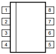

# Eeprom memories

## ST

### 160D0WQ

This is an EEPROM from ST. Datasheet is not publicly available. Package is SOP-8. In place, it is supplied with 5V.

| Pin # | Function |
| ----- | -------- |
| 1     | GND      |
| 2     | #CS      |
| 3     | ?        |
| 4     | MISO     |
| 5     | ?        |
| 6     | CLK      |
| 7     | MOSI     |
| 8     | VCC      |

Missing pins would probably correspond to write protect and hold functionalities.

### 95320WQ

This is an EEPROM from ST. Datasheet is not publicly available. Package is SOP-8. In place, it is supplied with 5V.

| Pin # | Function |
| ----- | -------- |
| 1     | #CS      |
| 2     | MISO     |
| 3     | ?        |
| 4     | GND      |
| 5     | MOSI     |
| 6     | CLK      |
| 7     | ?        |
| 8     | VCC      |
