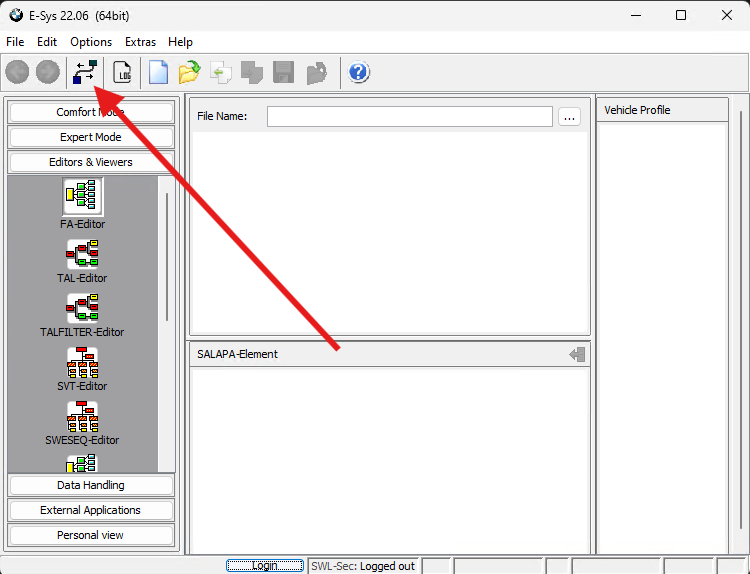
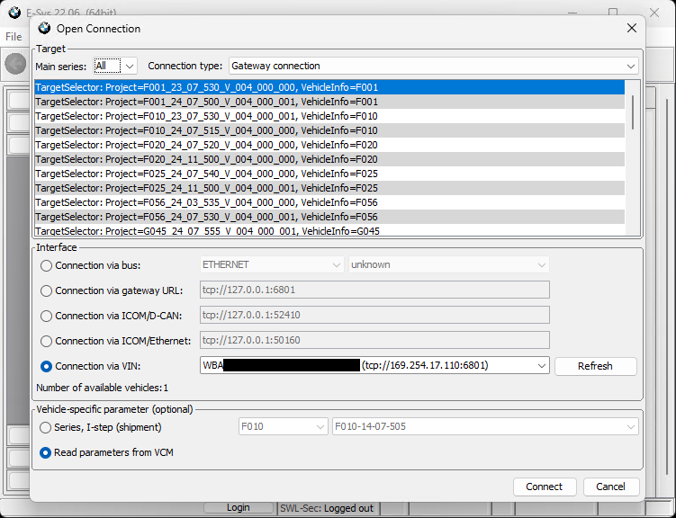
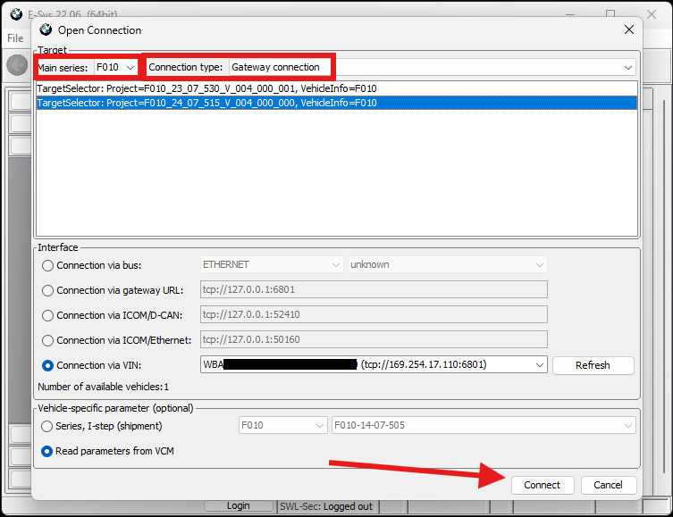
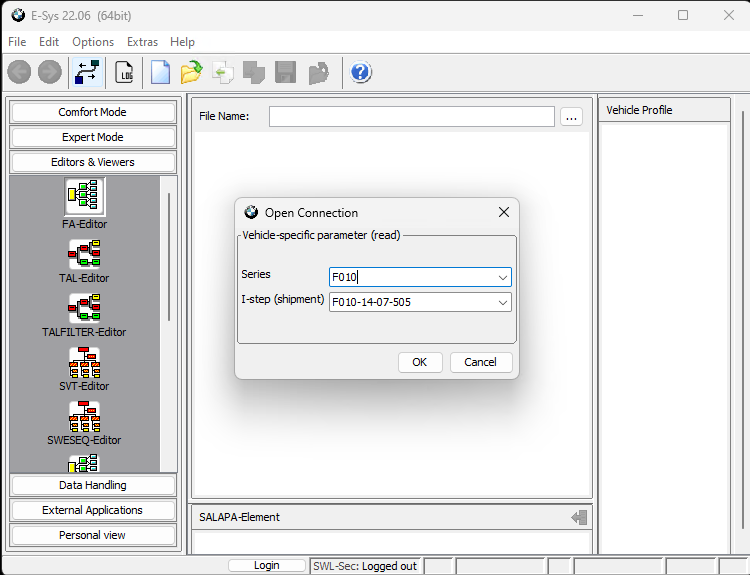
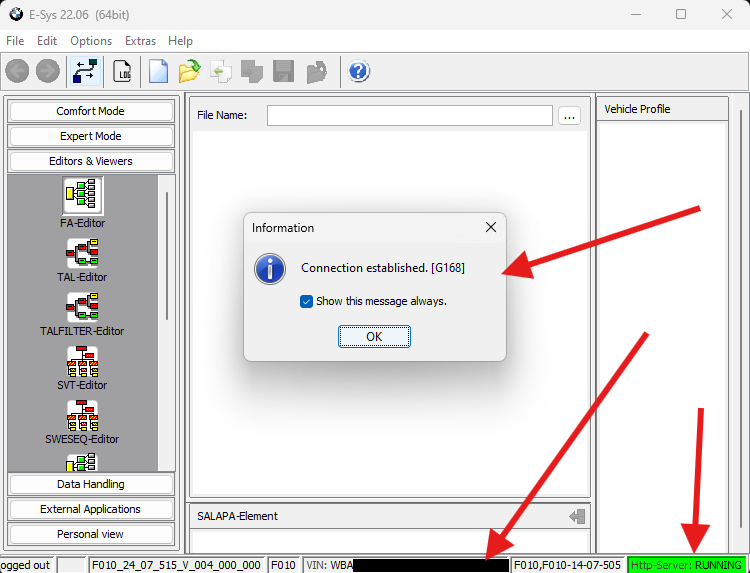

# Connecting E-SYS to a car

E-SYS allows you to perform many operations offline and has editors that work with files in your PC without a connection to your car but, at some point you may want to be able to nnect to your car to read, modify and write information to it.

For this, you will need to connect your PC to the vehicle.
Checkout the [Diagnostic Port]() section for more information on how to do that.

Once physically connected, you may click the new connection icon in the main window.

A new dialog will appear. If your car is correctly connected, E-Sys will try to identify it and will show your VIN number (redacted by a black square in the image below). Here, we will need to configure how we want to connect to our car.

In the top of the dialog, we will be able to select the correct parameters for our connection, in order to limit the options in the main selector:

- Main series: This refers to the car family. See [Development Codes]() to locate the main series for your car.
- Connection type: This parameter allows you to indicate wether you are connecting to a vehicle via a gateway (ZGW module) or wether you are connecting directly to an isolated ECU without a gateway. Normally, you will be connecting to a car via a gateway unless you have specifically built a wiring harness to connect to an isolated module directly. If in doubt, choose connection via gateway.

Once the adecuate options are selected, the main window will show less _TargetSelector_ items.
The elements in the target selector will differ in ther [I-Level]().
Select either of the available elements.

Also, select _Connection via VIN_ if your connection hardware has been correctly detected.

Finally, select _Read parameters from VCM_ and click on _Connect_.

A new dialog allowing you to select an I-Level will pop up. Click _OK_ to accept the detected version.

You will now be connected to the car and E-Sys will show your a confirmation dialog as well as vehicle info in the lower part of the screen.

You will be able to disconnect from a car by clicking the connection icon in the main bar again.
