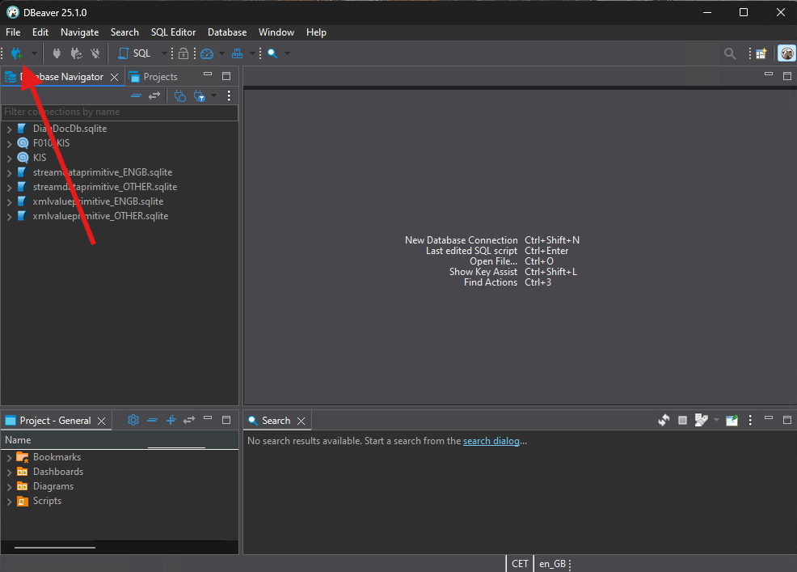
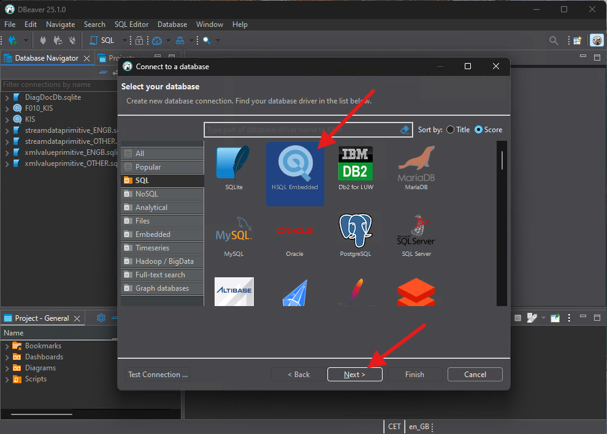
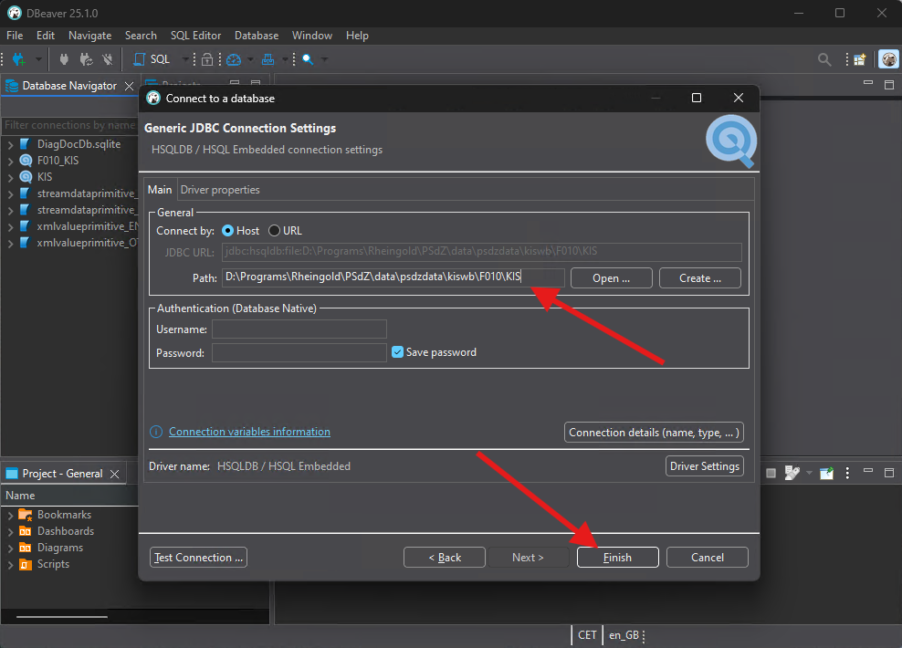

# KISWB

_PSdzData_ has many many components. Inside _PSdzData_ folder structures you may find some folders named _KISWB_. The _KIS_ portion of the name stands for something similar to compatibility and information system and _WB_ portion of that name comes from WissensBasis that means knowledge base in English.

The files contained inside _KISWB_ are HSQL databases. These files can be opened using any HyperSQL DataBase client. Currently, my recommended tool to work with KISWB databases is [DBeaver](https://dbeaver.io/download/).

## Browsing KISWB

In order to open a KISWB download and install [DBeaver](https://dbeaver.io/download/). Open the program and click on the new database connection button.

From the option list select HSQL Embedded option and click on _Next_.

Select the folder path of the KISWB database you want to browse. Also, make sure you append the _KIS_ file name at the end. Clock on Finish.

You may now browse the database contents.

## KISWB Tables

| Table name         | Contents description                                                                        |
| ------------------ | ------------------------------------------------------------------------------------------- |
| BORDNETZTEILNEHMER | Contains the names, descriptions and network addresses of the electronic elements of a car. |
| BNTNMAPPING        | Contains the bootloader ID (software element) for each electronic element of a car.         |
