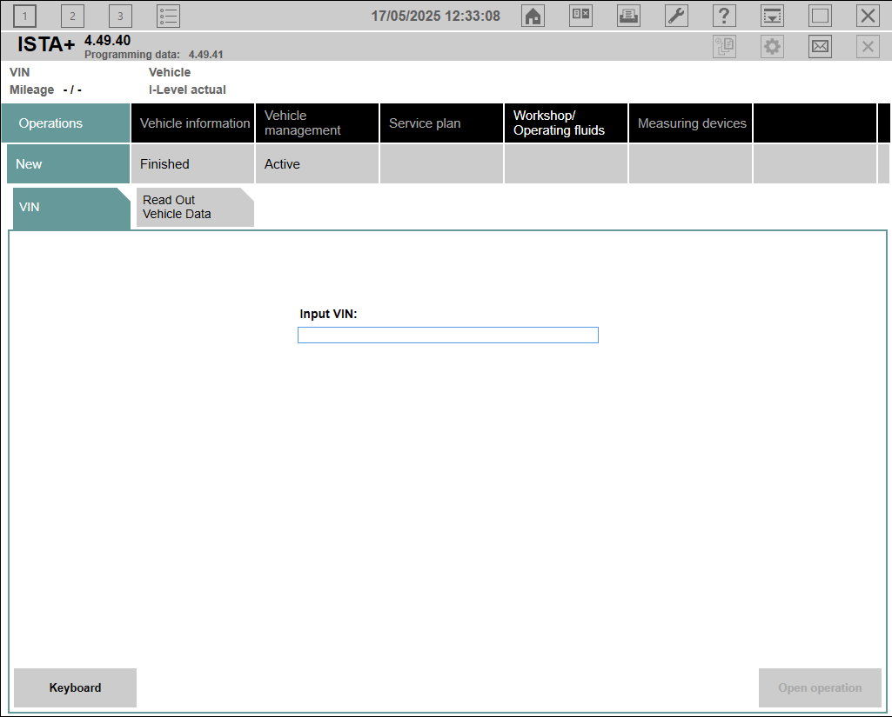

# ISTA+ Operations

ISTA+ revolves around the concep of operations.
To do things with ISTA+ you need to open an operation and to close it after you finish.

ISTA+ is able to simultaneously have up to three operations at any moment.

## Starting an operation

For ISTA+ to know what information to show, it is needed to create an _operation_ for a particular car.
This can be done with or without a car connection.

An _operation_ is kind of a session where you will need to specify what car you will be working with.
Once a session is started, ISTA+ will know what schematics to show out of the thousands of variants that are there, what ECUs to expect in a car or how to perform a diagnosis for that particular vehicle.

To Start an _operation_ click on the _Operations_ tab and in the _New_ subtab.

### Without a car connection

You may start an operation on a car that you are not currently connected to.
This can be done by inputting the VIN to ISTA and clicking on _Open operation_.

This mode allows you to consult information and documentation on the vehicle but will not offer the full functionality of the suite because of the lack of connection.

### With a car connection

ISTA allows you to automatically read vehicle information from a physical vehicle connection.
For this, you will need to connect your PC to the vehicle.
Checkout the [Diagnostic Port]() section for more information on how to do that.

Once physically connected, you may select the _Read Out Vehicle Data_ tab under the new operations section.

ISTA will offer you two options. A fast _Identification without vehicle test_ or a _Complete identification_.

Both options will work and if you choose the fast identification, you can always perform the vehicle test in a later stage.
